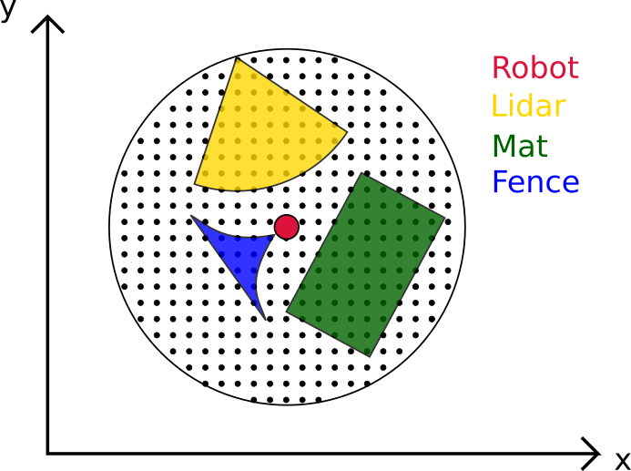

## Sensor Placement

This repository serves for simulation environment of the optimization algorithms w.r.t the sensor placement. 

In one word, this optimization problem could be defined as how to use the minimal number or 
cheapest sensor sets to ensure a best safety criteria. In the current version, we define the safety situation, when
the black dots near the robot are covered by the sensor set, as the image bellow shows.



## Sensor Types
In the current  version, we defined three different types of sensors: Laser, Mat and Fence.
### 1. Laser
    - Parameters: Position, angle resolution, frame rate, detection range (distance and angle range)
    - Function: Detect worker's position when the worker moves in its' range.
    
    


### 2. Fence
    - Parameters: Length, width, position
    - Function: Reflect the human motion's direction.
    
    

### 3. Mate
    - Parameters: Position, length, width
    - Function: Detect worker's position when the worker directly on its' surface.
    
    

## Working Scenario
1. One industrial robot in the centre of working space, fully extended with maximal range.
2. One worker walks randomly in the environment.
3. When the worker is inside the sensor's detection range, the detection result will be visualized.


## How to run
1. run *simulator_with_factory* for randomly generate the sensors in working area and the optimal configuration will be 
visualized.
2. run *simulator* only for demo

## Next step
1. Combined with cost function to get the optimal solution w.r.t different criteria.

## Python Package Requirements
```txt
imageio==2.6.1
numpy==1.16.4
matplotlib==3.1.0
shapely==1.6.4
```

## Project notes:
1. Use @staticmethod for a clean class structure.
2. Use 'raise NotImplementedError' in the Base class.
3. Use Factory method for multiple object.
4. **dict or *list to get single respondent value.
5. Write unit test for stable and convenient test. 
